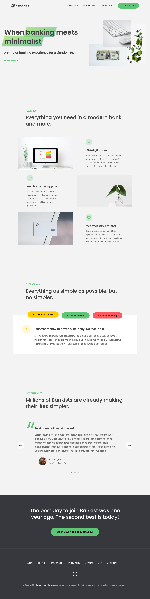

# 🏦 Bankist Landing Page

A minimalist and landing page for **Bankist**, a fictional banking app. This JavaScript project showcases smooth scrolling, sticky navigation, lazy image loading, section reveals, a testimonial slider, and interactive UI elements.

## Live-Demo

[VISIT WEBPAGE](https://bankist-landing-page-daria-aleshina.netlify.app/)

⚠️ Mobile Responsiveness: This project is best viewed on desktop. Mobile support is in progress!

## Features

- **Smooth Page Navigation:** Clickable navigation links with smooth scrolling.
- **Sticky Navigation:** Navigation bar sticks to the top on scroll.
- **Lazy Image Loading:** Images load dynamically for better performance.
- **Section Reveal on Scroll:** Sections become visible as the user scrolls down.
- **Tab Component:** Interactive operations tab with instant content switching.
- **Testimonial Slider:** Dynamic slider with navigation buttons and dots.
- **Responsive Design:** Fully optimized for mobile and desktop screens.

## Acknowledgments

This project is inspired by **Jonas Schmedtmann's JavaScript course on Udemy**. HTML / CSS provided by the course.

## Screenshot

